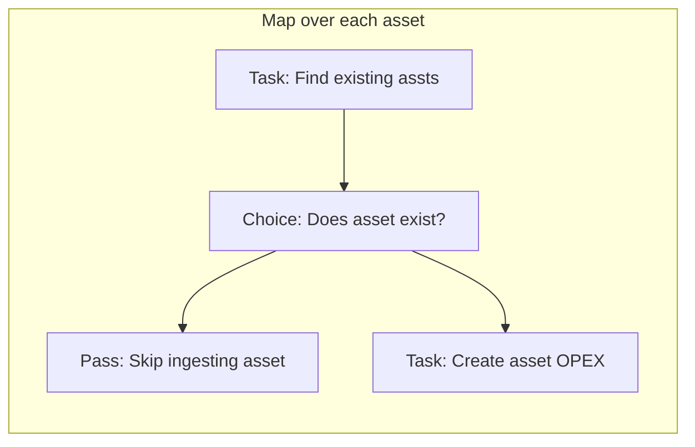

# DR2 Ingest

Ingesting to the Preservation System is orchestrated by a single AWS Step Function. Our process expects a single JSON file defining the ingest package and referencing objects in S3 buckets our process can read from. Our process will then load this data into a DynamoDB table, modify entities in the Preservation System using the REST API, assemble a package for ingest into the Preservation System, monitor the ingest, and reconcile the ingested with the source.

```mermaid
flowchart LR;
    Start([Start])
    --> Validate[Validate]
    --> Mapper
    --> FindExistingAsset[Find existing asset]
    --> AssetOpexCreator[Asset OPEX Creator]
    --> FolderOpexCreator[Folder OPEX Creator]
    --> ParentFoldrOpexCreator[Parent Folder OPEX Creator]
    --> CopyToPreservationSystem[Copy to Preservation System]
    --> StartWorkflow[Start Workflow]
    --> WorflowMonitor[Workflow monitor]
    --> Reconcile[Reconcile assets and children]
    --> UpdateTable[Update ingest table]
    --> UnlockAsset[Remove asset from lock table]
    --> QueryGroup[Query lock table for aggregation group]
    --> End([End])

    FindExistingAsset --> Reconcile
    QueryGroup --> RetryGroup[Retry preingest for group]
```



## Input

Ingest is started by calling the AWS API to start a new execution of the `dr2-ingest` Step Function. The name of the execution and input are important, as is the [`metadataPackage` JSON file](/docs/metadataPackage.md) which defines the ingest batch.

### Execution Name

The execution name is expected in the format `<sourceSystem>_<uniqueId>_<retryCount>`, for example `TDR_821e3470-c741-421a-acf2-8076ca30041e_0`. Executions with a name in other formats do work, but we cannot guarantee they will as we continue building.

### Execution Input

All fields are mandatory within the execution input.

```json
{
	"batchId": "TDR_35f61161-05d7-4c43-8c2b-f47a70330ad9_0",
	"groupId": "TDR_35f61161-05d7-4c43-8c2b-f47a70330ad9",
	"metadataPackage": "s3://<bucket>/TDR_35f61161-05d7-4c43-8c2b-f47a70330ad9_0.json",
	"retryCount": 0,
	"retrySfnArn": "arn:aws:states:<region>:<account>:stateMachine:<env>-dr2-preingest-tdr"
}
```

- `batchId` - The ID of this ingest batch, in the format `<groupId>_<retryCount>`.
- `groupId` - The ID of the aggregation group, in the format `<sourceSystem>_<uniqueId>`.
- `metadataPackage` - The S3 location (S3 URI) of the JSON file defining this batch.
- `retryCount` - The number of retries attempted on this aggregation group including the ingest of this batch.
- `retrySfnArn` - The ARN of the source system specific preingest Step Function that must be re-run if the ingest finishes but assets are still present in the aggregation group.

## Process

### Validation

First, [we validate the input](/scala/lambdas/ingest-validate-generic-ingest-inputs/) the to Step Function is as expected. This function validates both the State Data and the contents of the `metadataPackage` file.

### Mapper

The [Mapper Lambda](/scala/lambdas/ingest-mapper/) reads the contents of the `metadataPackage` file, mutates this to add new ArchiveFolders for the department(s) and series by looking up descriptive metadata from the [Discovery API](https://www.nationalarchives.gov.uk/help/discovery-for-developers-about-the-application-programming-interface-api/), calculates the `parentPath` as a concatination of the `parentId`s to the top of the tree, and writes each object to our `dr2-ingest-files` DynamoDB table.

We change to using `parentPath` when writing to DynamoDB to benefit from querying with a Global Secondary Index and remove the need to recursively query query items to reach the top of our tree.

### Upsert Archive Folders

[This Lambda](/scala/lambdas/ingest-upsert-archive-folders/) is responsible for creating or updating certain folders within the Preservation System. This step is required as the default behaviour of the ingest mechanism is to place the full package within a nominated folder, ingesting as a child of the root node is not possible within the Preservation System. We also have a requirement to update some folder metadata on subsequent ingests, for example, if the Discovery title or description of a dept/series changes, we’d want to update this within the Preservation System.

Both when creating or updating a folder, identifiers are passed through into the Preservation System’s native Identifier feature. Any field prefixed with `id_`, will create or update the identifier of that type. E.g. id_Code will become the Code identifier within the Preservation System. This has been implemented as the values of identifiers can be dependent on upstream system - court documents have a Cite identifier which other document types do not, court documents also exist in a “case folder” with a custom Code identifier.

### Asset OPEX Creation



The Preservation System is expecting an [OPEX package](https://developers.preservica.com/documentation/open-preservation-exchange-opex) to ingest. Our process needs to transform the JSON file we started with into a package of this format. We must also deduplicate as part of our ingest process to prevent storing multiple of the same asset in the Preservation System. As an ingest batch could contain thousands of assets with even more files that need copying, we horizontally scale the processing of this step using a Step Function Map State.

For each asset we first [check to see if it's already in the Preservation System](/scala/lambdas/ingest-find-existing-asset/). If it is, we add the `skipIngest` attribute to our DynamoDB table and ignore the asset when generating the OPEX package. We maintain the asset within our DynamoDB table to allow us to reconcile the new ingest candiate against the existing ingested asset to ensure they are the same - we want to appear idempotent to clients.

If the asset doesn't already exist within the Preservation System, we proceed to generate a an unzipped [PAX](https://developers.preservica.com/documentation/preservation-asset-exchange-pax) and OPEX representation of it at the correct location within a single OPEX package for the whole batch. As our representation of an asset has fewer levels of hierarchy than the Preservation System's, we’ve hardcoded some duplication into this process to create the additional levels; each File within our package generates a CO with a single bitstream. The `id` of our files (which are UUIDs) become the titles of the CO entities as the Preservation System uses the bitstream filenames as the object keys in S3, which could expose sensitive data. We add descriptive metadata as part of the OPEX representation, using the same logic applied in our [Upsert Lambda](/scala/lambdas/ingest-upsert-archive-folders/).

### Folder OPEX Creation

Once we’ve created our PAX packages and `.pax.opex` files, we can create our .opex files that describe each folder within our package. This step needs to happen **after** our Asset OPEX Creator has run as we need to include the filesize of these files within our folder .opex files.

Similar to our Asset OPEX Creator, this Lambda is run in a Map State, but this time passed the `id` of an ArchiveFolder or ContentFolder item within our DynamoDB table. Both types are processed in the same way, with the exception that ArchiveFolder adds the <opex:SourceID> element to the document with the `id` value from our table; within the Preservation System this merges the new folder with the folder we created/found when the Upsert Lambda ran.

Within the Preservation System, we’ve enabled the feature Require folder manifests which only allows an ingest to proceed if all subfolders and files are included within the .opex manifests. This reduces the potential for a race condition, where the system begins ingesting whilst we’re still writing packages and enforces a check that the OPEX package we’ve supplied is complete. Unfortunately, it also requires that the top level folder (our root node) also have an .opex manifest; this is a folder that doesn’t get created within the Preservation System but only exists to hold our ingest package for the ingest workflow. As this folder isn’t represented in our package and therefore also not in our DynamoDB table, we’ve [implemented a hack to create this file by listing the contents of our S3 prefix](/scala/lambdas/ingest-parent-folder-opex-creator/).

### Copy to the Preservation System

So far, we've created our OPEX ingest package within a bucket we own. As we're using a managed service for the Preservation System we need to copy the package to an ingest location it can read from. We've used DataSync to do this.

### Ingesting

Next, we [start](/scala/lambdas/ingest-start-workflow/) and [monitor](/scala/lambdas/ingest-workflow-monitor/) the ingest workflow within the Preservation System. We poll routinely to confirm the ingest is still running and check the status.

### Asset reconciliation

Once the Preservation System has finished ingesting the package, we want to [confirm that the full package has ingested and no mutations occurred](/scala/lambdas/ingest-asset-reconciler/) during thw process. Once again, we use the Step Function Map State to iterate through every asset within the ingest package to check this. We alert when a reconciliation fails.

If reconciliation is successful, we mark the asset as ingested to the Preservation System and begin the clean-up process; we remove the lock we placed on the asset during preingest, allowing duplicate messages to be processed impotently, and cleanup artifacts created for the asset as part of ingesting.

### Aggregation group check

Finally, before the Step Function ends, we query the `dr2-ingest-lock` using the `groupId` again. We do this to catch a race condition where our preingest workflow created an ingest package before the DynamoDB GSI had been fully populated. If any assets are found within this group to still hold a lock we increase the `retryCount` and re-invoke the preingest process for the `groupId`, creating a new batch containing the missing items.
