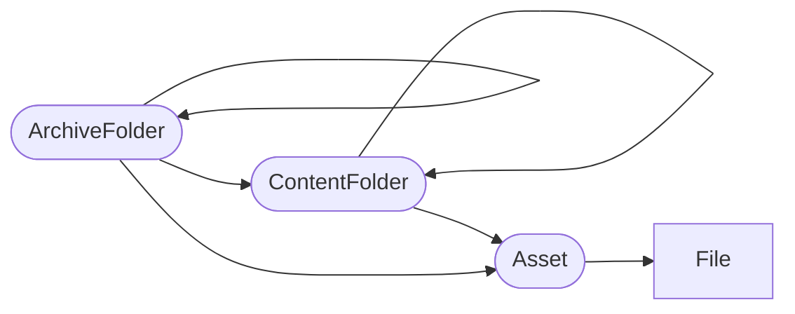

# metadataPackage JSON File

The input to our `dr2-ingest` Step Function includes an S3 URI to a JSON file describing the package to be ingested below the Preservation System folders for the series. The JSON file contains a single array of objects, where each object represents a folder, Asset, or File within the package.

There are 4 types of object supported within the package;

- `ArchiveFolder` - Represents a folder created to manage archival hierarchy. When ingesting, if a folder already exists in the Preservation System with the given `id` the metadata of that folder is updated if a new `title`, `description`, or `id_` fields are given.
- `ContentFolder` - Represents a folder that was included within the transfer. These folders are passed to the Preservation System but will not update metadata on subsequent ingests (process managed by the Preservation System).
- `Asset` - Represents a record or information object. The asset is the granular entity within our processes; we ingest, process, and report on asset activities.
- `File` - A digital file or bitstream within an Asset.

The hierarchy of these types is enforced, ArchiveFolder and ContentFolder can repeat recursively but ArchiveFolders cannot be children of ContentFolders. The root node(s) of an ingest package can be of type ArchiveFolder, ContentFolder, or Asset. All objects within the array **MUST** have a valid `parentId` property referencing another object within the array or a `series` property.

A metadataPackage containing a top level folder or Asset `A` with series `ABC 123` would be placed at `ABC/ABC 123/A` in the Preservation System. If the series is not known, set the series as `Unknown` to place the item at `Unknown/A`.

## Supported Fields

### ArchiveFolder

| Name        | Required | Description                                                                                                                                                                                                                     |
| ----------- | -------- | ------------------------------------------------------------------------------------------------------------------------------------------------------------------------------------------------------------------------------- |
| description | no       | The description of the folder. On ingest, the description of the folder in the Preservation System is set to this value if present; on subsequent ingests, the description is only updated if a `description` is given.           |
| id          | yes      | A unique identifier within the ingest package for this folder.                                                                                                                                                                  |
| id\_\*      | no       | Sets an identifier in the Preservation System. E.g. `id_Code` becomes the `Code` identifier.                                                                                                                                    |
| name        | yes      | The name of the folder, can be used to refer to the same folder across ingests. As this is the ArchiveFolder type it will be stored in the Preservation System and used as the key for future updates to this folder.           |
| parentId    | yes\*    | The `id` of the object's parent (also within this JSON file).                                                                                                                                                                   |
| series      | yes\*    | If the item is a root node in this ingest package, set this to the series reference the item should ingest under or `Unknown`.                                                                                                   |
| title       | no       | The title of the folder; `name` will be used if not given. On ingest, the title of the folder in the Preservation System is set to this value if present; on subsequent ingests, the title is only updated if a `title` is given. |
| type        | yes      | The item type (`ArchiveFolder`).                                                                                                                                                                                                |

\*Either a `parentId` or `series` is required.

### ContentFolder

| Name        | Required | Description                                                                                                                   |
| ----------- | -------- | ----------------------------------------------------------------------------------------------------------------------------- |
| id          | yes      | A unique identifier within the ingest package for this folder.                                                                |
| description | no       | The description of this folder.                                                                                               |
| name        | yes      | The name of the folder.                                                                                                       |
| parentId    | yes\*    | The `id` of the object's parent (also within this JSON file).                                                                 |
| series      | yes\*    | If the item is a root node in this ingest package set this to the series reference the item should ingest under or `Unknown`. |
| title       | no       | The title of the folder, `name` will be used if not given.                                                                    |
| type        | yes      | The item type (`ContentFolder`).                                                                                              |

\*Either a `parentId` or `series` is required.

### Asset

| Name                     | Required | Description                                                                                                                   |
| ------------------------ | -------- | ----------------------------------------------------------------------------------------------------------------------------- |
| correlationId            | no       | A string to correlate notification messages about the ingest of the asset. Useful for client services.                        |
| description              | no       | The description of this asset.                                                                                                |
| digitalAssetSource       | yes\*\*  | The source of the digital asset. E.g. `Born Digital`.                                                                         |
| digitalAssetSubtype      | no       | The subtype of digital asset. E.g. `FCL`                                                                                      |
| id                       | yes      | A unique identifier for this asset.                                                                                           |
| id\_\*                   | no\*\*\* | Sets an identifier in the Preservation System. E.g. `id_Code` becomes the `Code` identifier.                                  |
| originalMetadataFiles    | yes\*\*  | A JSON array of file `id`s that make up the asset metadata as transferred.                                                    |
| parentId                 | yes\*    | The `id` of the object's parent (also within this JSON file).                                                                 |
| series                   | yes\*    | If the item is a root node in this ingest package set this to the series reference the item should ingest under or `Unknown`. |
| title                    | no       | The title of this asset; `id` will be used if not given.                                                                      |
| transferCompleteDatetime | yes\*\*  | The datetime the transfer to The National Archives was completed.                                                             |
| transferringBody         | yes\*\*  | The organisation that transferred this record to The National Archives.                                                       |
| type                     | yes      | The item type (`Asset`).                                                                                                      |
| upstreamSystem           | yes\*\*  | The system Digital Records Repository received this asset from.                                                               |

\* Either a `parentId` or `series` is required.  
\*\* Required for custom metadata within the Preservation System.  
\*\*\* `id_ConsignmentReference`, and `id_RecordID` are required for custom metadata within the Preservation System.

### File

| Name                 | Required | Description                                                                                                                                                                                                           |
| -------------------- | -------- | --------------------------------------------------------------------------------------------------------------------------------------------------------------------------------------------------------------------- |
| checksum\_\*         | yes      | The hexadecimal checksum(s) for this file in the format. E.g. `checksum_SHA256`. Supported algorithms: `MD5`, `SHA1`, `SHA256`, `SHA512`.                                                                             |
| fileSize             | yes      | The filesize in bytes.                                                                                                                                                                                                |
| id                   | yes      | A unique identifier within the ingest package for this file.                                                                                                                                                          |
| name                 | yes      | The filename.                                                                                                                                                                                                         |
| parentId             | yes      | The `id` of the object's parent (also within this JSON file).                                                                                                                                                         |
| representationSuffix | yes      | The suffix for the representation of the asset this file belongs to. E.g. `1`.                                                                                                                                        |
| representationType   | yes      | The type of representation of the asset this file belongs to. E.g. `Preservation`. The `representationType` and `representationSuffix` and concatenated to make a representation name within the Preservation System. |
| sortOrder            | yes      | The position of this file amongst other files that belong to the same asset. E.g. Book page number.                                                                                                                   |
| type                 | yes      | The item type (`File`).                                                                                                                                                                                               |

## Example

See the [dr2-ingest-validate-generic-input-ingest-inputs](/scala/lambdas/ingest-validate-generic-ingest-inputs/) Lambda documentation for an example.
