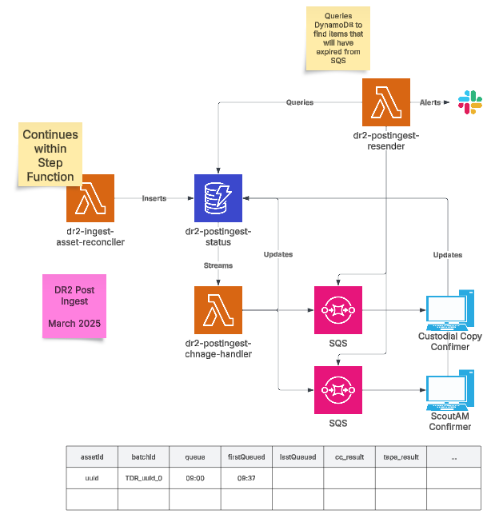

# Postingest

Postingest is the process by which we send messages to the external notifications topic when certain parts of the ingest
process have completed.

## Infrastructure diagram



## Flow

### Insert to DynamoDB from Step Function

When an asset has been reconciled in the ingest step function. An entry is added to the dr2-postingest-state
table.

The input field is the text that will be sent to the next process.

When this Dynamo row is inserted:

| assetId                              | batchId                                  | input                                                           |
|--------------------------------------|------------------------------------------|-----------------------------------------------------------------|
| e2715719-c313-4e95-b5e6-f8759dcc6aed | TDR_0cae3480-2b84-42a7-b899-dcce25aee98b | {"preservationSystemId":"9a83532d-dd26-442d-b259-b1823f668649"} |

The postingest-state-change lambda is triggered.

### State change lambda - first run

As this is an insert to the table, and the insert is done after a successful reconcile, this message is sent to the
output topic.

```json
{
  "body": {
    "properties": {
      "messageType": "preserve.digital.asset.ingest.update"
    },
    "parameters": {
      "assetId": "e2715719-c313-4e95-b5e6-f8759dcc6aed",
      "status": "Asset has been ingested to the Preservation System."
    }
  }
}
```

The lambda is configured with an environment variable which tells it which queues it needs to send messages to and in
which order.
The config for this lambda is:

```json
[
  {
    "queueAlias": "CC",
    "queueOrder": 1,
    "queueUrl": "https://sqs.eu-west-2.amazonaws.com/1/intg-dr2-custodial-copy-confirmer"
  },
  {
    "queueAlias": "Scout",
    "queueOrder": 2,
    "queueUrl": "https://sqs.eu-west-2.amazonaws.com/2/intg-dr2-scout-am-confirmer"
  }
]
```

The lambda checks to see if there is a field set on this row called ingested_CC.

There isn't and so it sends the message stored in the input field in the Dynamo table to the
custodial-copy-confirmer-queue.
It updates the firstQueued and lastQueued attributes in the table to the current time and sets the queue field to CC.

### Custodial Copy Confirmer

The Custodial Copy confirmer process picks this up. If it is in the OCFL repository, it deletes the SQS message and adds
an ingested_CC attribute to Dynamo, as well as updating the input message to the input the next step in the process will
need.
If it is not in the OCFL repository, it does nothing and the message sits in the queue. We will set a long visibility
timeout on these queues to prevent processing the same message too often.

Assuming it has found the asset in the OCFL repository and updated the Dynamo table, this will trigger the
postingest-state-change lambda again.

### State change lambda - second run

The lambda loads the configuration json from the environment variable.

It checks the difference between the old and new images from the Dynamo stream input.
It then looks to see if ingested_CC has been added with this update. It has, so it sends this message.

```json
{
  "body": {
    "properties": {
      "messageType": "preserve.digital.asset.ingest.update"
    },
    "parameters": {
      "assetId": "e2715719-c313-4e95-b5e6-f8759dcc6aed",
      "status": "Asset has been written to custodial copy disk."
    }
  }
}
```

It then moves onto the next item in the queue and sends a message using the input field in the Dynamo table to the
ScoutAM confirmer.
It sets the firstQueued and lastQueued attributes to the current time and sets the queue field to Scout.

### ScoutAM Confirmer

The ScoutAM Confirmer doesn't yet exist, but it will.

This calls the ScoutAM API to see if the file has been written to tape. If it has, it deletes the message and adds the
ingested_Scout attribute to Dynamo.
If it is not, it does nothing.

Assuming it has been written to tape, this will trigger the postingest-state-change

### State change lambda - third run

The lambda loads the configuration json.

It checks the difference between the old and new images from the Dynamo stream input.
It then looks to see if ingested_CC has been added with this update. It hasn't, so it moves to the next item in the
config
It then looks to see if ingested_Scout has been added with this update. It has and it is also the last item in the queue
so it sends this message.

```json
{
  "body": {
    "properties": {
      "messageType": "preserve.digital.asset.ingest.complete"
    },
    "parameters": {
      "assetId": "e2715719-c313-4e95-b5e6-f8759dcc6aed",
      "status": "Asset has been written to data tape."
    }
  }
}
```

It has no more queues to process. It deletes the row from the postingest table.

## Unprocessed messages after two weeks

It is possible for various reasons that the messages in the SQS queues have not been processed within the two week time
limit for SQS.

To solve this, we will have a lambda which will run on a schedule. The lambda will query each of the queues in its
configuration, which is the same as for the state change lambda.

Given:
This config

```json
[
  {
    "queueAlias": "CC",
    "queueOrder": 1,
    "queueUrl": "https://sqs.eu-west-2.amazonaws.com/1/intg-dr2-custodial-copy-confirmer"
  }
]
```

A date of 2025-06-19T16:24

This Dynamo table. Some fields are omitted for clarity.

| assetId                              | batchId                                  | input                                                           | lastQueued       | queue |
|--------------------------------------|------------------------------------------|-----------------------------------------------------------------|------------------|-------|
| e2715719-c313-4e95-b5e6-f8759dcc6aed | TDR_0cae3480-2b84-42a7-b899-dcce25aee98b | {"preservationSystemId":"9a83532d-dd26-442d-b259-b1823f668649"} | 2025-06-05T10:00 | CC    |
| ca3bb9d5-c5bf-4da8-9ad7-a937f163b006 | TDR_5d29749b-4891-4ae4-abdd-d57c9bab00ee | {"preservationSystemId":"f6c52bdd-c245-4439-992e-7a3358407b36"} | 2025-06-05T10:00 | CC    |                |
 

The query will find everything that was sent to the CC queue but hasn't been processed for more than two weeks which in this example is the first row. 

The resender will then send the message in the input field to the queue in its own config, update the lastQueued date to now and exit.