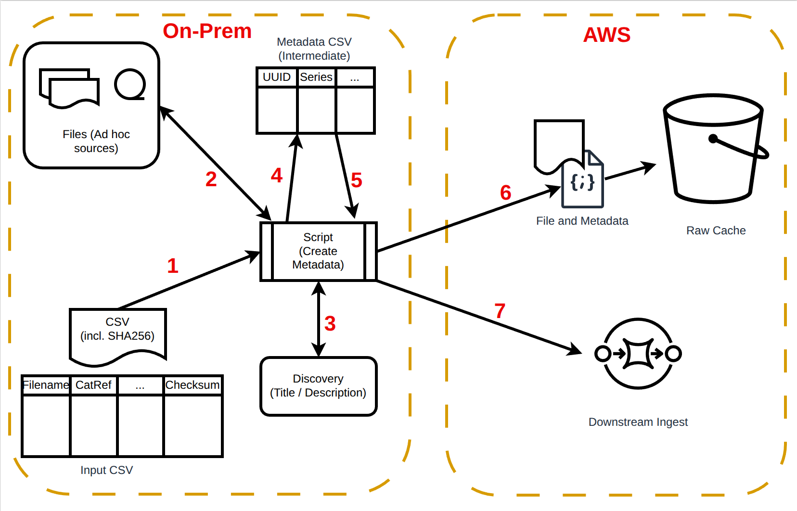

# Ad hoc Ingest

This directory contains the scripts used for ingesting the data from hard drives that The National Archives has 
received over the years. The scripts and process applies to the data which meets the following criteria:
- The data has been already received and held on some storage media 
- The data is NOT ingested in the existing DRI system
- The data has been already available to the public on Discovery.

## The process:

There is a script at the centre of the ingest process which drives the generic ingest. The script receives a CSV file as an input. This CSV file contains the filenames, catalog reference, any other information and a checksum. The files are located on the hard drives or any other media which can be made accessible to the script. The script works by in these steps (marked in red in the picture)

- Read the CSV file and find out the details for each file 
- Optionally, Get additional metadata from discovery (such as Title, Description etc.)
- Generates an intermediate CSV file which has each row representing one metadata file. 
  - This CSV is useful for users to inspect the metadata before actual ingest
- If the user has run the script with `dry_run` set to true, the script terminates at this point, otherwise it carries on to next step 
- Copy the file from the source to raw-cache bucket 
- Generate metadata Json from the intermediate CSV per row and copy the metadata json to raw-cache bucket
- Send a message to the generic ingest queue to kick start the downstream process of ingest.

## How to run the script:
The script needs to be run from a machine on web domain which has access to the internet. The script needs to connect 
to Discovery to get some metadata for the records. It also needs to connect to AWS services to upload the file into 
S3 bucket and send a message to <env>-dr2-preingest-dri-importer queue to trigger the copy lambda.

### Script Arguments 
| Name               | Description                                                                       |
|--------------------|-----------------------------------------------------------------------------------|
| -i   --input       | A CSV (or Excel) file having rows corresponding to the data to be ingested.   |
|                    | &emsp;Each row has Catalog Reference (catRef), name of the file (fileName) with   |
|                    | absolute path, and optionally, checksum for the file to be ingested               |
| -e  --environment  | Name of the environment where the records are ingested (e.g. intg, prd)           |
|                    | The script makes use of the environment name to construct names of the AWS        |
|                    | resources (default 'INTG')                                                        |
| -d   --dry_run     | Boolean value, when True indicates that the script should only validate the       |
|                    | data but stop short of actually uploading it to S3. False indicates that          |
|                    | the script should ingest data as well. (default False)                            |

### Script steps
1. Read the input file
2. Carry out validations on the input file 
   - Unique columns.
   - Mandatory columns.
   - Non nullable columns
   - Whether the file exists at the path mentioned
3. Read one row of the input file at a time 
4. Generate metadata for that row 
5. Upload the metadata file and the data file to S3
6. Send a message to trigger the downstream processing.

