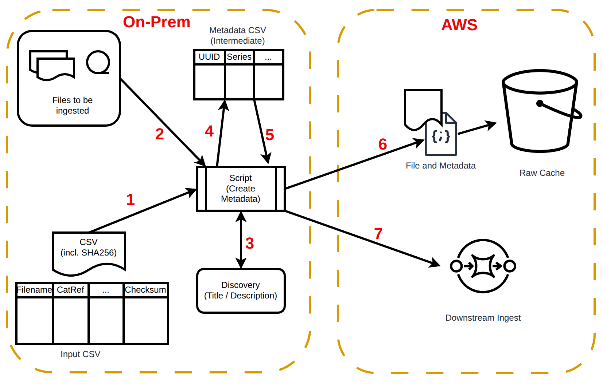

# Ad hoc Ingest

This directory contains the scripts used for ingesting the data from ad hoc sources such as hard drives that 
The National Archives has received over the years. The scripts and process strictly applies to the data 
which meets the following criteria:
- The data has been already received and held on some storage media 
- The data is NOT ingested into the existing preservation system
- The data has been already available to the public on Discovery.

## The process:

There is a script (ad_hoc_ingest.py) at the centre of the ingest process which drives the generic ingest. The script receives a CSV file as an input. 
This input CSV file contains the filenames, catalogue reference, a checksum and any other information. The files are 
located in a folder or other media which can be made accessible to the script. The script works chronologically in steps 
as shown in the diagram.

### Script steps
1. Check that the script is at the latest version by getting and md5 checksum of the remote and local files and comparing them. 
2. If the script has been updated, the user is asked if they want to proceed. 
3. Read the input CSV file, where each row in the CSV has a Catalogue Reference, Filename and a Checksum corresponding to each file to be ingested.
4. The input CSV may optionally have a column called `description` in the file.
5. Read the files to be ingested from ad-hoc source and carry out validations on the input file.
   - The validations depend on Series to be ingested. 
For each row in the input CSV file,
6. If the 'description' is supplied in the input file, it is used. Otherwise, use Discovery API to get hold of the Title, Description and Former References.
7. Generate metadata and add it as a row to intermediate metadata CSV file.
   - The advantage of having metadata in CSV is, the user can examine the potential final metadata before ingesting. 
For each row in the Metadata CSV file,
8. Generate a Metadata JSON file and get absolute path of the file to be ingested. 
9. Upload the Metadata JSON and the file to `dr2-ingest-adhoc-cache` bucket. 
10. Send a message to `dr2-preingest-adhoc-importer` to trigger the downstream preingest process.

An example of the input CSV file is shown below:

|catRef|description|fileName|checksum|
|------|-----------|--------|--------|
|S 31/2/1, f 0v | Page f 0v of the book | Y:/domesday/book pages/10_half.png | 4a3b2311c781f19b4642baeae66503ac57b0d0d9ce0b91694b588f7ae269675d |
|S 31/2/1, f 0r | Page f 0r of the book | Y:/domesday/book pages/11_half.png | d5e9e908640ebced69ce8c4d9059362cec5eafa9a4e7190f364d42ba44cfb3c6 |

## How to run the script:
If the description is not supplied in the input CSV, the script needs to connect to Discovery API to get some metadata, which 
includes the description for the records. It also needs to connect to AWS services to upload each file and its metadata into 
an S3 bucket and send a message to `dr2-preingest-adhoc-importer` queue to trigger the downstream process. As a result, 
the script has following pre-requisites: 
- It needs to be run from a machine which has access to the internet 
- It is run by a user who has relevant permissions to add data to the `dr2-ingest-adhoc-cache` bucket
- It is run by a user who has permission to send message to the adhoc-et by a user who has permissions to access the relevant AWS services. 

### Script Arguments 

`-i   --input`
    A CSV (or Excel) file having rows corresponding to the data to be ingested. Each row has a Catalogue Reference (catRef), name of the file (fileName) with absolute path, and optionally, a checksum for the file to be ingested

`-e  --environment`
    Name of the environment where the records are ingested (e.g. intg, prod). The script makes use of the environment name to construct names of the AWS resources (default 'intg')

`-d   --dry-run`
    Boolean value, when True, indicates that the script should only validate the data but stop short of actually uploading it to S3. False indicates that the script should ingest data as well. (default False)

`-o   --output` 
    Optional file path where the intermediate results are stored. When available, the output of dry run is stored in that file. If not given, the script generates a file in the "tmp" folder of the machine

`-s   --asset-source` 
    Optional digital asset source, one of:('Born Digital', 'Surrogate' or 'Digitised') default is 'Born Digital'

