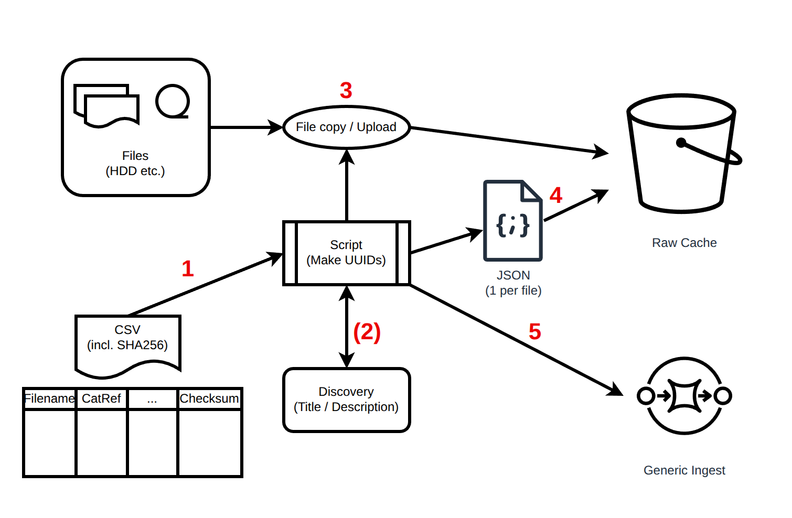

# HDD Ingest

This directory contains the scripts used for ingesting the data from hard drives that The National Archives has 
received over the years. The scripts and process applies to the data which meets the following criteria:
- The data has been already received and held on some storage media 
- The data is NOT ingested in the existing DRI system
- The data has been already available to the public on Discovery.

## The process:

There is a script at the centre of the ingest process which drives the generic ingest. The script receives a CSV file as an input. This CSV file contains the filenames, catalog reference, any other information and a checksum. The files are located on the hard drives or any other media which can be made accessible to the script. The script works by in these steps (marked in red in the picture)

- Read the CSV file and find out the details for each file 
- Optionally, Get additional metadata from discovery (such as Title, Description etc.)
- Copy the file from the HDD to raw-cache bucket 
- Create and copy the metadata json corresponding to the file
- Send a message to the generic ingest queue to kick start the downstream process of ingest.

